<a id="inicio"></a>

<div align="center">

<!-- ═══════════════ PORTADA ═══════════════ -->


<br/>


<br/><br/>

<!-- ═══════════════ Menú de navegación ═══════════════ -->
<a href="#sobre-mi"></a>
<a href="#tecnologias"></a>
<a href="#progreso"></a>
<a href="#proyecto"></a>
<a href="#estadisticas"></a>
<a href="#musica"></a>
<a href="#contacto"></a>

</div>

<br/>


<!-- ═══════════════ SOBRE MÍ ═══════════════ -->
<a id="sobre-mi"></a>
<h2 align="center">𝄞 ¿Quién soy? 𝄞</h2>

<div align="center">

<!-- Texto que se escribe solo. Para cambiar las frases: edita lo que va después de "lines=" y separa cada frase con ; (usa + en lugar de espacios) -->


<br/><br/>

<table>
<tr>
<td align="center" valign="middle">

<!-- Gato animado (assets/cat-coding.svg). Si prefieres un GIF, cambia el src por la URL del GIF -->


</td>
<td valign="middle">

```text
╭───────────────────────────────────── perfil.sys ─────────────────────────────────────╮
const yo = {
  👤 nombre:             "Fernando Clemente",
  📍 ubicación:          "Guatemala 🇬🇹",
  🎓 rol:                "Estudiante de ingenieria en ciencias y sistemas",
  🌱 aprendiendo:        ["HTML", "CSS", "JavaScript"],
  🧰 herramientas:       ["Git", "GitHub", "Visual Studio"],
  🎯 objetivo:           "Crear un portafolio sólido y seguir mejorando cada día 🚀",
};
╰──────────────────────────────────────────────────────────────────────────────────────╯
```

Este perfil es mi **Trayectoria**: aquí subo lo que aprendo, mis errores y mis avances.

🟣 *Menos "no sé", más "lo estoy intentando".*

</td>
</tr>
</table>

</div>

<br/>


<!-- ═══════════════ TECNOLOGÍAS ═══════════════ -->
<a id="tecnologias"></a>
<h2 align="center">𝄞 Tecnologías y herramientas 𝄞</h2>

<div align="center">

**🌐 Lo que estoy aprendiendo**

 

<br/>

**🧰 Herramientas que uso**


<br/><br/>


</div>

<br/>


<!-- ═══════════════ PROGRESO ═══════════════ -->
<a id="progreso"></a>
<h2 align="center">𝄞 Progreso de aprendizaje 𝄞</h2>

<div align="center">

| Tecnología | Nivel | Progreso |
|:-----------|:------|:--------:|
| 🐙 **GitHub** | Iniciando |  |
| 🌐 **HTML** | Básico |  |
| 🎨 **CSS** | Iniciando |  |
| ⚡ **JavaScript** | Iniciando |  |
| 🔀 **Git** | Iniciando |  |

</div>

<br/>


<!-- ═══════════════ PROYECTO ═══════════════ -->
<a id="proyecto"></a>
<h2 align="center">𝄞 Proyecto destacado 𝄞</h2>

<div align="center">

<!-- Cambia TU-REPO por el nombre de tu repositorio -->
<a href="https://github.com/FernandoClemente326/TU-REPO">
  
</a>

</div>

<br/>


<!-- ═══════════════ ESTADÍSTICAS ═══════════════ -->
<a id="estadisticas"></a>
<h2 align="center">𝄞 Estadísticas de GitHub 𝄞</h2>

<div align="center">


<br/>


<br/>


<br/><br/>

**🐍 La serpiente se come mis contribuciones**


</div>

<br/>


<!-- ═══════════════ FRASE ═══════════════ -->
<h2 align="center">𝄞 Frase para programar 𝄞</h2>

<div align="center">

</div>

<br/>


<!-- ═══════════════ MÚSICA ═══════════════ -->
<a id="musica"></a>
<h2 align="center">𝄞 Música 𝄞</h2>

<div align="center">

<!-- Cambia TU-PLAYLIST y TU-USUARIO-SPOTIFY por tus datos reales -->
<a href="https://open.spotify.com/playlist/TU-PLAYLIST">
  
</a>

<br/><br/>

<a href="https://open.spotify.com/user/TU-USUARIO-SPOTIFY"></a>
<a href="https://open.spotify.com/playlist/TU-PLAYLIST"></a>

<h3>⏳ La integración de este apartado estará disponible próximamente.</h3>

</div>

<br/>


<!-- ═══════════════ CONTACTO ═══════════════ -->
<a id="contacto"></a>
<h2 align="center">𝄞 Contáctame 𝄞</h2>

<div align="center">

<br/>

<!-- Cambia TU-USUARIO, el correo y el número de WhatsApp (formato: 502 + tu número, sin espacios ni +) -->
<a href="https://www.linkedin.com/in/TU-USUARIO"></a>
<a href="mailto:tucorreo@ejemplo.com"></a>
<a href="https://wa.me/50200000000"></a>

<h3>⏳ La integración de enlaces de este apartado estará disponible próximamente.</h3>

<br/><br/>

**Hecho con 💜 y mucha curiosidad en Guatemala 🇬🇹**

<sub><a href="#inicio">↑ Volver al inicio</a></sub>

<!-- ═══════════════ CIERRE ═══════════════ -->


</div>
